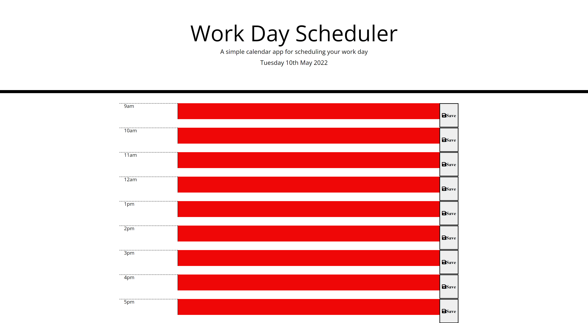

# HomeWork_JSJ_Wk5

# 05 Third-Party APIs: Work Day Scheduler

```md
- This app will run in the browser and feature dynamically updated HTML and CSS powered by jQuery.

- Uses the [Moment.js](https://momentjs.com/) library to work with date and time.

- WHEN the user opens the planner THEN the current day is displayed at the top of the calendar

- WHEN the user scrolls down THEN they are presented with timeblocks for standard business hours

-WHEN the user views the timeblocks for that day THEN each timeblock is color coded to indicate whether it is in the past, present, or future

-WHEN the user clicks into a timeblock THEN they can enter an event

-WHEN they click the save button for that timeblock THEN the text for that event is saved in local storage
```

```md

```

## Screenshot



## Deployed URL

- https://jeerjs.github.io/HomeWork_JSJ_Wk5/ - Link To Live Page

- https://github.com/jeerjs/HomeWork_JSJ_Wk5 - Link To Repository
